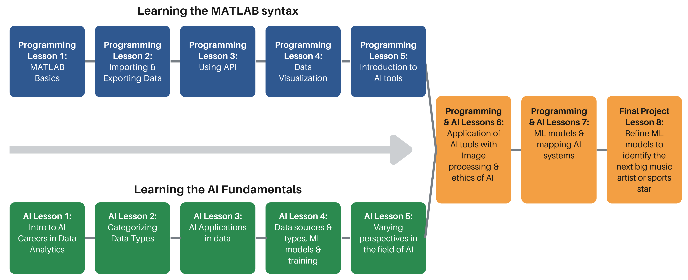

```{r setup, include=FALSE}
knitr::opts_chunk$set(echo = TRUE)
```

```{video embed, include=FALSE}
library("vembedr")
```


**Contact Us:** equipd@mse.ufl.edu

```{r pressure, echo=FALSE, fig.cap="", out.width = '100%'}

```


<!-- <span style="color: #d35a10;">Orange text</span> -->
<!-- <span style="color: #4484b5;">Blue text</span> -->

# **Introduction**
Welcome to the MathWorks UF Data Analytics Summer Camp resource hub, designed to support high school educators in introducing students to data analysis and AI applications in MATLAB through sports and music-themed activities. This site offers a range of resources, including lesson plans, interactive presentations, MATLAB files, tutorial videos, and more—all organized to help you engage students in exploring programming and AI concepts.

With these resources, students will build a strong foundation in MATLAB, advancing from basic coding principles to complex machine learning models. The curriculum emphasizes practical applications, guiding students through hands-on activities and culminating in a final project where they create and present their own unique models.

Whether you're teaching foundational programming skills or diving into data analytics and machine learning, this hub provides comprehensive, step-by-step materials to make your instruction both effective and engaging. Even if you're new to MATLAB or AI, the tutorials, ready-made tools, and well-structured lesson plans here will equip you to lead students confidently through real-world data challenges in sports and music contexts.

# **Program Overview**
AI, machine learning, and programming are transforming how we live and work—whether it’s through facial recognition, personalized recommendations, or predictive tools in sports and entertainment. These technologies are now essential skills for students to learn.

The MathWorks UF Data Analytics Summer Camp gives students hands-on experience with data analytics and AI using MATLAB. Students act as data analysts for a sports team or music label, using data to make real-world predictions, like identifying the next breakout athlete or music star.

This repository provides teachers with everything they need to teach these concepts effectively, including lesson plans, activities, and real-world examples to engage students and bring AI and data analytics to life.

## Program Roadmap




**1. Foundations of Data Analytics and MATLAB**
      
The program begins with four foundational lessons that introduce essential data analytics skills. Students learn basic MATLAB syntax and operations, techniques for importing and managing datasets, data visualization methods, and how to access real-world data through APIs. These foundational skills equip students to approach data analysis in a structured, informed way.

Corresponding Lessons: [Programming Lesson 1], [Programming Lesson 2], [Programming Lesson 3], [Programming Lesson 4]

**2.    Introduction to AI and Machine Learning Concepts**

Alongside technical skills, students are introduced to fundamental AI and machine learning concepts, including how models make predictions, ethical considerations in AI, and real-world applications across fields. These concepts are connected to familiar sports and music contexts, providing relevant examples to ground theoretical knowledge.

Corresponding Lessons: [AI Lesson 1], [AI Lesson 2], [AI Lesson 3], [AI Lesson 4], [AI Lesson 5], [AI Lesson 6], [AI Lesson 7]

**3.    Applying Advanced Techniques in Data Analysis**

Once students have a solid foundation, they move into more advanced techniques like image processing and MATLAB’s AI toolkit to conduct deeper analyses. This phase includes practical applications, such as analyzing visual data or testing prediction models, reinforcing their skills and preparing them for a final project.

Corresponding Lessons: [Programming Lesson 5], [Programming Lesson 6]

**4.    Culminating Project: Predicting Future Stars**

The program concludes with a comprehensive project where students apply their skills to predict future stars in sports or music. Using insights from their analyses, they present their findings and predictions, demonstrating their understanding of data analytics and AI in a practical context.

Corresponding Lessons: [Programming Lesson 7], [Programming Lesson 8]

# **What You Need to Get Started**
In this section, we will walk you through the essential tools and resources required for instructors and teachers before diving into the lessons provided. These include MATLAB Online, the Spotify API, a list of whitelisted websites, and MATLAB Drive.

## MATLAB Online
MATLAB Online is the cloud-based version of MATLAB, allowing you to use MATLAB directly through your web browser without needing to install or download any software. This environment provides full access to the programming features and tools available in the desktop version. Throughout this course, MATLAB Online will be the primary platform for teaching students programming concepts, machine learning, and AI tools in a seamless, accessible way. With MATLAB Online, students can easily access lessons from any device with an internet connection, making it ideal for both in-class and remote learning. This  <a href="https://www.youtube.com/watch?v=kwNFpoY3dKk" target="_blank">link</a> provides instructions on creating a MathWorks Account and accessing MATLAB Online.

Click this <a href="https://www.youtube.com/watch?v=kwNFpoY3dKk" target="_blank">link</a> to watch a tutorial on creating a Mathworks Account and Access MATLAB Online.

## Spotify API
The Spotify API will play a significant role in many lessons, particularly those involving data retrieval and manipulation. The Spotify API is a RESTful web service that allows users to access Spotify’s vast music database without needing to install software locally. Students will use it to gather real-world music data for various exercises and projects, such as creating prediction models or analyzing song attributes like danceability or duration. Teachers will need to guide students in setting up API access and using it to fetch and process music-related data, which can be integrated into their MATLAB projects. This <a href="https://developer.spotify.com/documentation/web-api" target="_blank">link</a> provides the developer page for the Spotify API.

Click this <a href="https://developer.spotify.com/documentation/web-api" target="_blank">link</a> to access the developer page for the Spotify API.

## White List Websites
Some websites and services used throughout this course may be blocked by school networks or firewalls. To avoid any disruptions, a PDF document is provided with a list of essential websites that need to be whitelisted or unblocked before teaching can begin. This ensures smooth access to necessary online resources, such as APIs and MATLAB Online. The list includes links to key websites that students and instructors will need throughout the course, so be sure to review and address any restrictions with your IT department ahead of time. <a href="https://github.com/UF-EQuIPDGrant/MathWorks-UF-Data-Analytics-Summer-Camp/blob/c770bdf30c62b9d31261fe66f2b61ae98d48cf95/Additional%20Resources/MATLAB%20Camp%20-%20Website%20Whitelist%20(2).pdf" target="_blank">PDF link</a>

Click this <a href="https://github.com/UF-EQuIPDGrant/MathWorks-UF-Data-Analytics-Summer-Camp/blob/c770bdf30c62b9d31261fe66f2b61ae98d48cf95/Additional%20Resources/MATLAB%20Camp%20-%20Website%20Whitelist%20(2).pdf" target="_blank">PDF link</a> to access the list of essential websites that need to be whitelisted or uncloked before teacher.

## MATLAB Drive
MATLAB Drive is a cloud-based storage solution integrated with MATLAB, allowing teachers and students to store, manage, and access MATLAB files from anywhere. This tool is especially useful for distributing lesson files, projects, and additional resources to students throughout the course. With MATLAB Drive, instructors can easily share assignments, code, and data files, while students can store their work and access it from any device. It streamlines collaboration and ensures that everyone has access to the materials they need for the course. Additionally, it simplifies file management, making it easier for both teachers and students to stay organized. This <a href="https://www.youtube.com/watch?v=Ap9fqfN1ioA" target="_blank">link</a> provides instructions on accessing the MATLAB drive.

Click this <a href="https://www.youtube.com/watch?v=Ap9fqfN1ioA" target="_blank">link</a> to watch a tutorial on acessing MATLAB drive.

# **Lesson Resources**
This section outlines the course structure you'll follow when teaching your students. Each lesson is divided into two main components: a Programming section and an AI section. Together, these sections build the foundational skills and knowledge necessary for students to complete a final project that combines programming and AI concepts in MATLAB.

**Programming Section**

The programming portion of each lesson focuses on core MATLAB syntax and basic programming concepts. These lessons equip students with essential skills to navigate MATLAB and use it as a problem-solving tool. Topics covered include printing outputs, modifying images, accessing and working with files, and creating plots. The aim is to provide students with a strong foundation in MATLAB, ensuring they have the confidence and ability to apply these skills in their final project.

**Artificial Intelligence Section**

In the AI section, students will explore the real-world applications and ethical considerations of AI. Lessons cover a wide range of topics, including image recognition, autonomous vehicles, and more. These lessons will not only introduce students to the technical aspects of AI but also foster discussions about its implications in society. By the end of this section, students will have a solid understanding of AI’s potential and limitations, preparing them to integrate AI into their own projects.

**Final Project**

The two sections of the course culminate in an exciting final project where students will use their programming and AI knowledge to create a predictive AI tool in MATLAB. Whether they choose to predict the next big pop artist, identify the next star soccer player, or focus on another field of their choice, this project allows students to combine creativity with technical skills.

**Lesson Pacing**

Each programming and AI lesson was designed to take approximately 85 minutes to complete. This may vary depending on the pace of the students in your camp. The course is designed to be flexible and adaptable, allowing you to tailor the lessons to your students' needs while maintaining structure and clear learning outcomes.

## Lesson 1


### Programming Lesson 1

**Summary:** This lesson begins the Foundations of Data Analytics and MATLAB [Program Roadmap] by introducing students to the MATLAB environment. They will explore basic navigation, scripting, and computations. Students will learn about variables, arrays, and writing scripts/functions to perform arithmetic and logical operations. 

**Estimated Time:** 85 minutes

**Objectives:**

*   Learn how to navigate MATLAB’s interface.
*   Understand basic variable assignment and array manipulation.
*   Write simple scripts to perform mathematical and logical operations.

**Key Terms:** Variables, Arrays, Functions, Scripts, Arithmetic Operations

**Resources:** 

*   <a href="https://github.com/UF-EQuIPDGrant/MathWorks-UF-Data-Analytics-Summer-Camp/raw/c770bdf30c62b9d31261fe66f2b61ae98d48cf95/Programming%20Lesson/Programming%20Lesson%201/Teacher%20Pages/ML_Sec01_TeacherGuide.docx" target="_blank">Word Document Lesson Outline (Download)</a>
*   <a href="https://github.com/UF-EQuIPDGrant/MathWorks-UF-Data-Analytics-Summer-Camp/blob/c770bdf30c62b9d31261fe66f2b61ae98d48cf95/Programming%20Lesson/Programming%20Lesson%201/Teacher%20Pages/ML_Sec01_TeacherGuide.pdf" target="_blank">PDF Document Lesson Outline</a>
*   <a href="https://github.com/UF-EQuIPDGrant/MathWorks-UF-Data-Analytics-Summer-Camp/raw/refs/heads/main/Programming%20Lesson/Programming%20Lesson%201/ML_Sec01_PPT.pptx" target="_blank">Presentation (Download)</a>   
*   MATLAB Drive Files 
    +   <a href="https://drive.mathworks.com/sharing/69b123f0-5eb1-4d9e-9a64-f14498986d9f/" target="_blank">MATLAB Student Files (MATLAB Drive)</a> 
    +   <a href="https://drive.mathworks.com/sharing/a0490fcd-6b6b-43f5-8843-0bde8995830a/" target="_blank">MATLAB Teacher Files (MATLAB Drive)</a>
*   Raw Files
    +   <a href="https://github.com/UF-EQuIPDGrant/MathWorks-UF-Data-Analytics-Summer-Camp/tree/0cf6b4479fb9951a1f13877c4d411c063649f61f/Raw%20MATLAB%20Files/MATLAB%20Student%20Files/Programming%20Lesson%201" target="_blank">MATLAB Student Files (Raw Files)</a>
    +   <a href="https://github.com/UF-EQuIPDGrant/MathWorks-UF-Data-Analytics-Summer-Camp/tree/0cf6b4479fb9951a1f13877c4d411c063649f61f/Raw%20MATLAB%20Files/MATLAB%20Teacher%20Files/Programming%20Lesson%201" target="_blank">MATLAB Teacher Files (Raw Files)</a> 


### AI Lesson 1

**Summary:** This lesson begins the Foundations of Data Analytics and MATLAB [Program Roadmap] by introducing the role of AI in identifying new talent in sports and entertainment. It emphasizes applications in A&R and sports analytics, guiding students to explore data-driven careers, learn predictive analytics, and create AI programs to analyze and predict talent.

**Estimated Time:** 85 minutes

**Objectives:**

*    Understand how AI is used in A&R and sports analytics to find talent.
*    Learn about careers in analytics, including salaries and education.
*    Explore databases and tools for analyzing sports and entertainment data.

**Key Terms:** Artificial Intelligence (AI), Predictive Analytics, Artist and Repertoire (A&R)

**Resources (Links to all the individual resources from github):** 

*   Teacher Materials
    +   <a href="https://github.com/UF-EQuIPDGrant/MathWorks-UF-Data-Analytics-Summer-Camp/raw/15e40a1a4c2c7d70604b008fb4116791fc9e932e/AI%20Lesson/AI%20Lesson%201/Teacher%20Pages/Main%20Page%20Section%201%20Assignment%201.docx" target="_blank">Word Document Assignment 1 Teacher Outline (Download)</a>
    +   <a href="https://github.com/UF-EQuIPDGrant/MathWorks-UF-Data-Analytics-Summer-Camp/raw/15e40a1a4c2c7d70604b008fb4116791fc9e932e/AI%20Lesson/AI%20Lesson%201/Teacher%20Pages/Main%20Page%20secion%201%20Assignment%202.docx" target="_blank">Word Document Assignment 2 Teacher Outline (Download)</a>
    +   <a href="https://github.com/UF-EQuIPDGrant/MathWorks-UF-Data-Analytics-Summer-Camp/raw/refs/heads/main/AI%20Lesson/AI%20Lesson%201/Student%20pages/Assigment%201%20Part%203%20Assignment%20How%20is%20AI%20used%20in%20Sports%20and%20AR%20Marketing.docx" target="_blank">Word Document Assignment 3 Teacher Outline (Download)</a>
    +   <a href="https://github.com/UF-EQuIPDGrant/MathWorks-UF-Data-Analytics-Summer-Camp/raw/refs/heads/main/AI%20Lesson/AI%20Lesson%201/ML_AI_Lesson1_PPT.pptx">Presentation (Download)</a> 
*   Student Materials    
    +   <a href="https://github.com/UF-EQuIPDGrant/MathWorks-UF-Data-Analytics-Summer-Camp/raw/15e40a1a4c2c7d70604b008fb4116791fc9e932e/AI%20Lesson/AI%20Lesson%201/Student%20pages/Section%201%20Assignment%20%201%20Understanding%20types%20of%20jobs.docx" target="_blank">Word Document Assignment 1 Student Outline (Download)</a>
    +   <a href="https://github.com/UF-EQuIPDGrant/MathWorks-UF-Data-Analytics-Summer-Camp/raw/15e40a1a4c2c7d70604b008fb4116791fc9e932e/AI%20Lesson/AI%20Lesson%201/Student%20pages/Section%201%20Assignment%202%20Understanding%20the%20role%20of%20data%20in%20A%20R%20Sports%20analytics(1).docx" target="_blank">Word Document Assignment 2 Student Outline (Download)</a>
    +   <a href="https://github.com/UF-EQuIPDGrant/MathWorks-UF-Data-Analytics-Summer-Camp/raw/15e40a1a4c2c7d70604b008fb4116791fc9e932e/AI%20Lesson/AI%20Lesson%201/Teacher%20Pages/Main%20Page%20Section%201%20Assignment%203.docx" target="_blank">Word Document Assignment 3 Student Outline (Download)</a>

## Lesson 2

### Programming Lesson 2 

**Summary:** This lesson continues the Foundations of Data Analytics and MATLAB [Program Roadmap] by introducing how to import, manipulate, and store data in MATLAB. This lesson focuses on data types, structures, importing/exporting data, and performing basic statistical analysis.

**Estimated Time:** 85 minutes

**Objectives:**

*   Import and export data from various file types (CSV, Excel).
*   Understand and manipulate different data structures like tables, arrays, and cell arrays.
*   Perform basic statistical operations like mean, median, and standard deviation.
*   Key Terms: Data Structures, Tables, Arrays, Import/Export, Basic Statistics

**Resources (Links to all the individual resources from github):**

*   <a href="https://github.com/UF-EQuIPDGrant/MathWorks-UF-Data-Analytics-Summer-Camp/raw/refs/heads/main/Programming%20Lesson/Programming%20Lesson%202/Teacher%20Pages/MATLAB_Section02_TeacherPage.docx" target="_blank">Word Document Lesson Outline (Download)</a>
*   <a href="https://github.com/UF-EQuIPDGrant/MathWorks-UF-Data-Analytics-Summer-Camp/blob/c770bdf30c62b9d31261fe66f2b61ae98d48cf95/Programming%20Lesson/Programming%20Lesson%202/Teacher%20Pages/MATLAB_Section02_TeacherPage.pdf" target="_blank">PDF Document Lesson Outline</a>
*   <a href="https://github.com/UF-EQuIPDGrant/MathWorks-UF-Data-Analytics-Summer-Camp/raw/refs/heads/main/Programming%20Lesson/Programming%20Lesson%202/ML_Sec02_PPT.pptx" target="_blank">Presentation (Download)</a>  
*   MATLAB Drive Files 
    +   <a href="https://drive.mathworks.com/sharing/53347f3d-9000-40d2-bed4-17be2902e89e/" target="_blank">MATLAB Student Files (MATLAB Drive)</a> 
    +   <a href="https://drive.mathworks.com/sharing/d31d0b53-ada7-4c15-9599-9d114b9f1c6f/" target="_blank">MATLAB Teacher Files (MATLAB Drive)</a>
*   Raw Files
    +   <a href="https://github.com/UF-EQuIPDGrant/MathWorks-UF-Data-Analytics-Summer-Camp/tree/aaea57f8dc77216998580fae2c6b3833fcf4676c/Raw%20MATLAB%20Files/MATLAB%20Student%20Files/Programming%20Lesson%202" target="_blank">MATLAB Student Files (Raw Files)</a>
    +   <a href="https://github.com/UF-EQuIPDGrant/MathWorks-UF-Data-Analytics-Summer-Camp/tree/aaea57f8dc77216998580fae2c6b3833fcf4676c/Raw%20MATLAB%20Files/MATLAB%20Teacher%20Files/Programming%20Lesson%202" target="_blank">MATLAB Teacher Files (Raw Files)</a> 


### AI Lesson 2

**Summary:** This lesson continues the Foundations of Data Analytics and MATLAB [Program Roadmap] by focusing on identifying and categorizing various data types used in sports and music analytics. Students will learn how different data types, such as integers, floats, and strings, represent metrics like performance statistics or artist characteristics. By the end of the lesson, they will be able to analyze and determine the data types of variables from sports and music datasets and explore how data can be stored, manipulated, and analyzed using MATLAB.

**Estimated Time:** 85 minutes

**Objectives:**

*   Identify and categorize various data types used in programming.
*   Recognize the importance of data types when handling data in MATLAB.
*   Classify sports and music data as primitive or non-primitive.

**Key Terms:** Data Types, Arrays, Strings, Floats

**Resources (Links to all the individual resources from github):** 

*   <a href="https://github.com/UF-EQuIPDGrant/MathWorks-UF-Data-Analytics-Summer-Camp/raw/refs/heads/main/AI%20Lesson/AI%20Lesson%202/Teacher%20Pages/Main%20Page%20AI%20Section%202%20-%20Data%20Types%20and%20Sources.docx" target="_blank">Word Document Teacher Assignment Outline (Download)</a>
*   <a href="https://github.com/UF-EQuIPDGrant/MathWorks-UF-Data-Analytics-Summer-Camp/raw/refs/heads/main/AI%20Lesson/AI%20Lesson%202/Student%20Pages/Assignnment%20Section%202-%20Data%20Types%20and%20sources.docx">Word Document Student Assignment Outline (Download)</a>
*   <a href="https://github.com/UF-EQuIPDGrant/MathWorks-UF-Data-Analytics-Summer-Camp/raw/refs/heads/main/AI%20Lesson/AI%20Lesson%202/ML_AI_Lesson2_PPT.pptx" target="_blank">Presentation (Download)</a>  

## Lesson 3

### Programming Lesson 3

**Summary:** This lesson continues the Foundations of Data Analytics and MATLAB [Program Roadmap] by introducing students to use APIs for retrieving external data. Students will work with HTTP requests, JSON parsing, and storing retrieved data for analysis.

**Estimated Time:** 85 minutes

**Objectives:**

*   Understand the basics of APIs and how they interact with external data sources.
*   Learn to make HTTP requests and parse JSON data.
*   Store and manage retrieved data in MATLAB.

**Key Terms:** APIs, HTTP Requests, JSON, Data Storage

**Resources (Links to all the individual resources from github):**

*   <a href="https://github.com/UF-EQuIPDGrant/MathWorks-UF-Data-Analytics-Summer-Camp/raw/refs/heads/main/Programming%20Lesson/Programming%20Lesson%203/Teacher%20Pages/ML_Sec03_TeacherGuide.docx" target="_blank">Word Document Lesson Outline (Download)</a>
*   <a href="https://github.com/UF-EQuIPDGrant/MathWorks-UF-Data-Analytics-Summer-Camp/blob/c770bdf30c62b9d31261fe66f2b61ae98d48cf95/Programming%20Lesson/Programming%20Lesson%203/Teacher%20Pages/ML_Sec03_TeacherGuide.pdf" target="_blank">PDF Document Lesson Outline</a>
*   <a href="https://github.com/UF-EQuIPDGrant/MathWorks-UF-Data-Analytics-Summer-Camp/raw/refs/heads/main/Programming%20Lesson/Programming%20Lesson%203/ML_Lesson03_PPT.pptx" target="_blank">Presentation (Download)</a>  
*   MATLAB Drive Files 
    +   <a href="https://drive.mathworks.com/sharing/51c15c50-0736-4675-9560-f342a5d04b6a/" target="_blank">MATLAB Student Files (MATLAB Drive)</a> 
    +   <a href="https://drive.mathworks.com/sharing/8821b137-8122-4183-b329-12e0ce3d678c/" target="_blank">MATLAB Teacher Files (MATLAB Drive)</a>
*   Raw Files
    +   <a href="https://github.com/UF-EQuIPDGrant/MathWorks-UF-Data-Analytics-Summer-Camp/tree/aaea57f8dc77216998580fae2c6b3833fcf4676c/Raw%20MATLAB%20Files/MATLAB%20Student%20Files/Programming%20Lesson%203" target="_blank">MATLAB Student Files (Raw Files)</a>
    +   <a href="https://github.com/UF-EQuIPDGrant/MathWorks-UF-Data-Analytics-Summer-Camp/tree/aaea57f8dc77216998580fae2c6b3833fcf4676c/Raw%20MATLAB%20Files/MATLAB%20Teacher%20Files/Programming%20Lesson%203" target="_blank">MATLAB Teacher Files (Raw Files)</a> 

### AI Lesson 3

**Summary:** This lesson continues the Foundations of Data Analytics and MATLAB [Program Roadmap] by exploring how data analysis is used to assess talent in sports or music. Students will identify key metrics, review data sources, and organize data into tables for analysis in MATLAB to compare artists or players.

**Estimated Time:** 85 minutes

**Objectives:**

*   Understand what data metrics are important in assessing talent in sports or music.
*   Learn how to find relevant data sources for talent evaluation.
*   Develop skills to create and organize data into a usable format for comparison and analysis.    


**Key Terms:** Metrics, Data Sources, API, Talent Evaluation 

**Resources (Links to all the individual resources from github):** 

*   <a href="https://github.com/UF-EQuIPDGrant/MathWorks-UF-Data-Analytics-Summer-Camp/raw/c770bdf30c62b9d31261fe66f2b61ae98d48cf95/AI%20Lesson/AI%20Lesson%203/Teacher%20Pages/Assignnment%20Section%203-%20Obtaining%20data.docx" target="_blank">Word Document Teacher Assignment Outline (Download)</a>
*   <a href="https://github.com/UF-EQuIPDGrant/MathWorks-UF-Data-Analytics-Summer-Camp/raw/refs/heads/main/AI%20Lesson/AI%20Lesson%203/Teacher%20Pages/Assignnment%20Section%203-%20Obtaining%20data.docx" target="_blank">Word Document Student Assignment Outline (Download)</a>
*   <a href="https://github.com/UF-EQuIPDGrant/MathWorks-UF-Data-Analytics-Summer-Camp/raw/refs/heads/main/AI%20Lesson/AI%20Lesson%203/ML_AI_Lesson3_PPT%20(1).pptx">Presentation (Download)</a>  

## Lesson 4

### Programming Lesson 4

**Summary:** This lesson continues the Foundations of Data Analytics and MATLAB [Program Roadmap] by introducing Students to visualizing data by creating and customizing various types of plots in MATLAB. This lesson covers both 2D and 3D plots.

**Estimated Time:** 85 minutes

**Objectives:**

*   Create and customize 2D and 3D plots in MATLAB.
*   Add labels, legends, and titles to plots.
*   Interpret and present data visually.

**Key Terms:** 2D Plot, 3D Plot, Data Visualization, Customization

**Resources (Links to all the individual resources from github):**

*   <a href="https://github.com/UF-EQuIPDGrant/MathWorks-UF-Data-Analytics-Summer-Camp/raw/refs/heads/main/Programming%20Lesson/Programming%20Lesson%204/Teacher%20Pages/ML_Sec04_TeacherGuide.docx" target="_blank">Word Document Lesson Outline (Download)</a>
*   <a href="https://github.com/UF-EQuIPDGrant/MathWorks-UF-Data-Analytics-Summer-Camp/blob/c770bdf30c62b9d31261fe66f2b61ae98d48cf95/Programming%20Lesson/Programming%20Lesson%204/Teacher%20Pages/ML_Sec04_TeacherGuide.pdf" target="_blank">PDF Document Lesson Outline</a>
*   <a href="https://github.com/UF-EQuIPDGrant/MathWorks-UF-Data-Analytics-Summer-Camp/raw/refs/heads/main/Programming%20Lesson/Programming%20Lesson%204/ML_Lesson04_PPT_v2.pptx" target="_blank">Presentation (Download)</a>  
*   MATLAB Drive Files 
    +   <a href="https://drive.mathworks.com/sharing/fdc134e4-641e-4bce-8ee7-02e6822a6c58/" target="_blank">MATLAB Student Files (MATLAB Drive)</a> 
    +   <a href="https://drive.mathworks.com/sharing/009c28d2-81b9-4952-b151-e0016d5d8273/" target="_blank">MATLAB Teacher Files (MATLAB Drive)</a>
*   Raw Files
    +   <a href="https://github.com/UF-EQuIPDGrant/MathWorks-UF-Data-Analytics-Summer-Camp/tree/aaea57f8dc77216998580fae2c6b3833fcf4676c/Raw%20MATLAB%20Files/MATLAB%20Student%20Files/Programming%20Lesson%204" target="_blank">MATLAB Student Files (Raw Files)</a>
    +   <a href="https://github.com/UF-EQuIPDGrant/MathWorks-UF-Data-Analytics-Summer-Camp/tree/aaea57f8dc77216998580fae2c6b3833fcf4676c/Raw%20MATLAB%20Files/MATLAB%20Teacher%20Files/Programming%20Lesson%204" target="_blank">MATLAB Teacher Files (Raw Files)</a> 
    

### AI Lesson 4

**Summary:** This lesson continues the Foundations of Data Analytics and MATLAB [Program Roadmap] by covering the training of machine learning (ML) models, focusing on supervised and unsupervised methods in regression, classification, clustering, and dimensionality reduction. It also highlights ML's computational demands and deployment through cloud and edge computing.

**Estimated Time:** 85 minutes

**Objectives:**

*    Understand how ML models are trained to analyze data.
*    Differentiate between supervised and unsupervised learning approaches.
*    Explore real-world applications of regression, classification, clustering, and dimensionality reduction.  

**Key Terms:** Machine Learning (ML), Regression, Clustering, Cloud Computing

**Resources (Links to all the individual resources from github):** 

*   Teacher Materials
    +   <a href="https://github.com/UF-EQuIPDGrant/MathWorks-UF-Data-Analytics-Summer-Camp/raw/15e40a1a4c2c7d70604b008fb4116791fc9e932e/AI%20Lesson/AI%20Lesson%204/Student%20Pages/Main%20Page%20Lesson%204%20Analyzing%20Data%20understanding%20models.docx">Main Page Word Document (Download)</a>
    +   <a href="https://github.com/UF-EQuIPDGrant/MathWorks-UF-Data-Analytics-Summer-Camp/raw/15e40a1a4c2c7d70604b008fb4116791fc9e932e/AI%20Lesson/AI%20Lesson%204/Student%20Pages/(ML)%20Section%204%20Assignment%201%20Main%20Page%20-Understanding%20How%20Supervised%20ML%20Models%20Work.docx">Word Document ML Models Assignment Teacher Outline (Download)</a>
    +   <a href="https://github.com/UF-EQuIPDGrant/MathWorks-UF-Data-Analytics-Summer-Camp/raw/15e40a1a4c2c7d70604b008fb4116791fc9e932e/AI%20Lesson/AI%20Lesson%204/Student%20Pages/(ML)%20Section%204%20Assignment%202%20Main%20Page-%20Mathematical%20Models%20for%20Machine%20Learning.docx">Word Document Mathematical Models Assignment Teacher Outline (Download)</a>
    +   <a href="https://github.com/UF-EQuIPDGrant/MathWorks-UF-Data-Analytics-Summer-Camp/raw/15e40a1a4c2c7d70604b008fb4116791fc9e932e/AI%20Lesson/AI%20Lesson%204/ML_AI_Lesson4_PPT.pptx">Presentation (Download)</a>    
*   Student Materials
    +   <a href="https://github.com/UF-EQuIPDGrant/MathWorks-UF-Data-Analytics-Summer-Camp/raw/15e40a1a4c2c7d70604b008fb4116791fc9e932e/AI%20Lesson/AI%20Lesson%204/Student%20Pages/Section%204%20Assignment%201%20Understanding%20how%20a%20model%20works.docx">Word Document ML Models Assignment Student Outline (Download)</a>
    +   <a href="https://github.com/UF-EQuIPDGrant/MathWorks-UF-Data-Analytics-Summer-Camp/raw/15e40a1a4c2c7d70604b008fb4116791fc9e932e/AI%20Lesson/AI%20Lesson%204/Student%20Pages/Section%204%20Case%20Study%20on%20Machine%20Learning.docx">Word Document Mathematical Models Assignment Student Outline (Download)</a>


## Lesson 5

### Programming Lesson 5

**Summary:** This lesson continues the Foundations of Data Analytics and MATLAB [Program Roadmap] by introducing MATLAB’s built-in AI and machine learning toolkits. Students will create and evaluate basic models using techniques such as regression and classification, focusing on the training process.

**Estimated Time:** 85 minutes

**Objectives:**

*   Explore MATLAB’s AI toolkits and understand basic machine learning techniques.
*   Train and evaluate regression and classification models.
*   Work with datasets to make predictions.

**Key Terms:** Regression, Classification, Model Training, AI Toolkit

**Resources (Links to all the individual resources from github):**

*   <a href="https://github.com/UF-EQuIPDGrant/MathWorks-UF-Data-Analytics-Summer-Camp/raw/refs/heads/main/Programming%20Lesson/Programming%20Lesson%205/Teacher%20Pages/ML_Sec05_TeacherGuide.docx" target="_blank">Word Document Lesson Outline (Download)</a>
*   <a href="https://github.com/UF-EQuIPDGrant/MathWorks-UF-Data-Analytics-Summer-Camp/blob/c770bdf30c62b9d31261fe66f2b61ae98d48cf95/Programming%20Lesson/Programming%20Lesson%205/Teacher%20Pages/ML_Sec05_TeacherGuide.pdf" target="_blank">PDF Document Lesson Outline</a>
*   <a href="https://github.com/UF-EQuIPDGrant/MathWorks-UF-Data-Analytics-Summer-Camp/raw/refs/heads/main/Programming%20Lesson/Programming%20Lesson%205/ML_Sec05_PPT1_v2.pptx" target="_blank">Presentation (Download)</a>  
*   MATLAB Drive Files 
    +   <a href="https://drive.mathworks.com/sharing/8cd58cfd-6a7e-40bf-8619-358f4712139f/" target="_blank">MATLAB Student Files (MATLAB Drive)</a> 
    +   <a href="https://drive.mathworks.com/sharing/95c563b4-645c-4564-ba37-a4e7491c4d23/" target="_blank">MATLAB Teacher Files (MATLAB Drive)</a>
*   Raw Files
    +   <a href="https://github.com/UF-EQuIPDGrant/MathWorks-UF-Data-Analytics-Summer-Camp/tree/aaea57f8dc77216998580fae2c6b3833fcf4676c/Raw%20MATLAB%20Files/MATLAB%20Student%20Files/Programming%20Lesson%205" target="_blank">MATLAB Student Files (Raw Files)</a>
    +   <a href="https://github.com/UF-EQuIPDGrant/MathWorks-UF-Data-Analytics-Summer-Camp/tree/aaea57f8dc77216998580fae2c6b3833fcf4676c/Raw%20MATLAB%20Files/MATLAB%20Teacher%20Files/Programming%20Lesson%205" target="_blank">MATLAB Teacher Files (Raw Files)</a>

### AI Lesson 5

**Summary:** This lesson builds on the Foundations of Data Analytics and MATLAB [Program Roadmap] by exploring how computers make predictions using statistical methods and machine learning algorithms. Students will learn about linear regression, its application in AI, and how it helps make informed predictions. Through practical exercises with data sets, they will understand how regression analysis enhances prediction accuracy in AI models.

**Estimated Time:** 85 minutes

**Objectives:**

*    Understand how computers make predictions.
*    Learn about algorithms used for prediction.
*    Explore basic statistical concepts that help improve predictions.

**Key Terms:** Linear Regression, Algorithm, Prediction

**Resources (Links to all the individual resources from github):** 

*   Teacher Materials 
    +   <a href="https://github.com/UF-EQuIPDGrant/MathWorks-UF-Data-Analytics-Summer-Camp/raw/refs/heads/main/AI%20Lesson/AI%20Lesson%205/ML%20Section%205%20Main%20Teacher%20Page.docx" target="_blank">Word Document Teacher Guide (Download)</a>
    +   <a href="https://github.com/UF-EQuIPDGrant/MathWorks-UF-Data-Analytics-Summer-Camp/raw/refs/heads/main/AI%20Lesson/AI%20Lesson%205/ML_AI_Lesson5_PPT.pptx">Presentation (Download)</a>
*   Student Materials     
    +   <a href="https://github.com/UF-EQuIPDGrant/MathWorks-UF-Data-Analytics-Summer-Camp/raw/refs/heads/main/AI%20Lesson/AI%20Lesson%205/Section%205%20Assignment%201%20predictions%20and%20outcomes.docx">Word Document of Predictions and Outcomes Assignment (Download)</a>  
    +   <a href="https://github.com/UF-EQuIPDGrant/MathWorks-UF-Data-Analytics-Summer-Camp/raw/refs/heads/main/AI%20Lesson/AI%20Lesson%205/Student%20performance%20scores.xlsx">Student Performance Scores Data Sheet (Download)</a>
    +   <a href="https://github.com/UF-EQuIPDGrant/MathWorks-UF-Data-Analytics-Summer-Camp/raw/refs/heads/main/AI%20Lesson/AI%20Lesson%205/2023%20NFL%20data%20stats.xlsx">2023 NFL Data Sheet (Download)</a>

## Lesson 6

### Programming Lesson 6

**Summary:** This lesson continues the Foundations of Data Analytics and MATLAB [Program Roadmap] by providing hands-on experience with MATLAB’s image processing tools. Students will learn to import, manipulate, and apply filters to images, as well as detect objects within images.

**Estimated Time:** 85 minutes

**Objectives:**

*   Import and manipulate images in MATLAB.
*   Apply filters to enhance or modify images.
*   Perform basic object detection tasks.

**Key Terms:** Image Processing, Object Detection, Filters, Image Manipulation

**Resources (Links to all the individual resources from github):**

*   <a href="https://github.com/UF-EQuIPDGrant/MathWorks-UF-Data-Analytics-Summer-Camp/raw/refs/heads/main/Programming%20Lesson/Programming%20Lesson%206/Teacher%20Pages/ML_Sec06_TeacherGuide.docx" target="_blank">Word Document Lesson Outline (Download)</a>
*   <a href="https://github.com/UF-EQuIPDGrant/MathWorks-UF-Data-Analytics-Summer-Camp/blob/c770bdf30c62b9d31261fe66f2b61ae98d48cf95/Programming%20Lesson/Programming%20Lesson%206/Teacher%20Pages/ML_Sec06_TeacherGuide.pdf" target="_blank">PDF Document Lesson Outline</a>
*   <a href="https://github.com/UF-EQuIPDGrant/MathWorks-UF-Data-Analytics-Summer-Camp/raw/refs/heads/main/Programming%20Lesson/Programming%20Lesson%206/ML_Sec06_PPT.pptx" target="_blank">Presentation (Download)</a>  
*   MATLAB Drive Files 
    +   <a href="https://drive.mathworks.com/sharing/9f4543d9-7323-41c8-beb5-dfd27182090d/" target="_blank">MATLAB Student Files (MATLAB Drive)</a> 
    +   <a href="https://drive.mathworks.com/sharing/2d194058-ee0c-4594-9cbd-c3326e596dfa/" target="_blank">MATLAB Teacher Files (MATLAB Drive)</a>
*   Raw Files
    +   <a href="https://github.com/UF-EQuIPDGrant/MathWorks-UF-Data-Analytics-Summer-Camp/tree/aaea57f8dc77216998580fae2c6b3833fcf4676c/Raw%20MATLAB%20Files/MATLAB%20Student%20Files/Programming%20Lesson%206" target="_blank">MATLAB Student Files (Raw Files)</a>
    +   <a href="https://github.com/UF-EQuIPDGrant/MathWorks-UF-Data-Analytics-Summer-Camp/tree/aaea57f8dc77216998580fae2c6b3833fcf4676c/Raw%20MATLAB%20Files/MATLAB%20Teacher%20Files/Programming%20Lesson%206" target="_blank">MATLAB Teacher Files (Raw Files)</a>

### AI Lesson 6

**Summary:** This lesson continues the Foundations of Data Analytics and MATLAB [Program Roadmap] by focusing on ethics in AI. Students will explore ethical concerns, responsibilities, and the importance of diversity in AI development. They will reflect on AI’s potential to cause harm, identify responsible parties for ethical dilemmas, and propose solutions using the “5 Pillars of Trust in AI.” The lesson also addresses the “Diversity Crisis” in AI, highlighting how bias can emerge from a lack of diversity in data and the importance of varied perspectives.

**Estimated Time:** 85 minutes

**Objectives:**

*    Understand and discuss the ethical concerns and responsibilities in AI.
*    Relate ethical concerns to IBM's "5 Pillars of Trust in AI".
*    Explore real-world AI dilemmas and the responsible parties involved.

**Key Terms:** AI Ethics, 5 Pillars of Trust in AI, AI Bias

**Resources (Links to all the individual resources from github):** 

*   Teacher Materials 
    +   <a href="https://github.com/UF-EQuIPDGrant/MathWorks-UF-Data-Analytics-Summer-Camp/raw/refs/heads/main/AI%20Lesson/AI%20Lesson%206/Teacher%20pages/Part%201/ML_AI_Lesson6_Part1_Teacher_Guide.docx" target="_blank">Word Document Teacher Guide Part 1 (Download)</a>
    +   <a href="https://github.com/UF-EQuIPDGrant/MathWorks-UF-Data-Analytics-Summer-Camp/blob/15e40a1a4c2c7d70604b008fb4116791fc9e932e/AI%20Lesson/AI%20Lesson%206/Teacher%20pages/Part%201/ML_AI_Lesson6_Part1_Teacher_Guide.pdf" target="_blank">PDF Document Teacher Document Part 1</a>
    +   <a href="https://github.com/UF-EQuIPDGrant/MathWorks-UF-Data-Analytics-Summer-Camp/raw/refs/heads/main/AI%20Lesson/AI%20Lesson%206/Teacher%20pages/Part%202/ML_AI_Lesson6_Part2_Teacher_Guide.docx" target="_blank">Word Document Teacher Guide Part 2 (Download)</a>
    +   <a href="https://github.com/UF-EQuIPDGrant/MathWorks-UF-Data-Analytics-Summer-Camp/blob/c770bdf30c62b9d31261fe66f2b61ae98d48cf95/AI%20Lesson/AI%20Lesson%206/Teacher%20pages/Part%202/ML_AI_Lesson6_Part2_Teacher_Guide.pdf">PDF Document Teacher Document Part 2</a>
    +   <a href="https://github.com/UF-EQuIPDGrant/MathWorks-UF-Data-Analytics-Summer-Camp/raw/refs/heads/main/AI%20Lesson/AI%20Lesson%206/ML_AI_Lesson06_Part1_PPT.pptx">Presentation Part 1 (Download)</a>
    +   <a href="https://github.com/UF-EQuIPDGrant/MathWorks-UF-Data-Analytics-Summer-Camp/raw/refs/heads/main/AI%20Lesson/AI%20Lesson%206/ML_AI_Lesson06_Part2_PPT.pptx" target="_blank">Presentation Part 2 (Download)</a>  
*   Student Materials     
    +   <a href="https://github.com/UF-EQuIPDGrant/MathWorks-UF-Data-Analytics-Summer-Camp/blob/15e40a1a4c2c7d70604b008fb4116791fc9e932e/AI%20Lesson/AI%20Lesson%206/Student%20pages/ML_AI_Lesson6_Part1_Handout.pdf" target="_blank">PDF Document Student Handout Part 1</a>
    +   <a href="https://github.com/UF-EQuIPDGrant/MathWorks-UF-Data-Analytics-Summer-Camp/blob/15e40a1a4c2c7d70604b008fb4116791fc9e932e/AI%20Lesson/AI%20Lesson%206/Student%20pages/ML_AI_Lesson6_Part2_Handout.pdf" target="_blank">PDF Document Student Handout Part 2</a>

## Lesson 7

### Programming Lesson 7

**Summary:** This lesson continues the Foundations of Data Analytics and MATLAB [Program Roadmap] by guiding students to design and develop machine learning models to predict the next popular musician or soccer player. The focus is on selecting appropriate features, building models using KNN or other classifiers, and analyzing real-world data from APIs.

**Estimated Time:** 85 minutes

**Objectives:**

*   Build a machine learning model using real-world data.
*   Utilize KNN or other classification techniques to make predictions.
*   Analyze and interpret the performance of the model.

**Key Terms:** KNN, Classification, Feature Selection, Prediction Models

**Resources (Links to all the individual resources from github):**

*   <a href="https://github.com/UF-EQuIPDGrant/MathWorks-UF-Data-Analytics-Summer-Camp/raw/refs/heads/main/Programming%20Lesson/Programming%20Lesson%207/Teacher%20Pages/Teacher%20Guides/ML_Sec07_TeacherGuide.docx">Word Document Lesson Outline Part 1 (Download)</a>
*   <a href="https://github.com/UF-EQuIPDGrant/MathWorks-UF-Data-Analytics-Summer-Camp/blob/89f5e9363cd289a3d7537cdca811955077324a8d/Programming%20Lesson/Programming%20Lesson%207/Teacher%20Pages/Teacher%20Guides/ML_Sec07_TeacherGuide.pdf" target="_blank">PDF Document Lesson Outline Part 1</a>
*   <a href="https://github.com/UF-EQuIPDGrant/MathWorks-UF-Data-Analytics-Summer-Camp/raw/refs/heads/main/Programming%20Lesson/Programming%20Lesson%207/Teacher%20Pages/Teacher%20Guides/ML_Sec08_TeacherGuide.docx">Word Document Lesson Outline Part 2 (Download)</a>
*   <a href="https://github.com/UF-EQuIPDGrant/MathWorks-UF-Data-Analytics-Summer-Camp/blob/89f5e9363cd289a3d7537cdca811955077324a8d/Programming%20Lesson/Programming%20Lesson%207/Teacher%20Pages/Teacher%20Guides/ML_Sec08_TeacherGuide.pdf" target="_blank">PDF Document Lesson Outline Part 2</a>
*   <a href="https://github.com/UF-EQuIPDGrant/MathWorks-UF-Data-Analytics-Summer-Camp/raw/refs/heads/main/Programming%20Lesson/Programming%20Lesson%207/ML_Sec07_PPT_v2.pptx">Presentation Part 1 (Download)</a>  
*   <a href="https://github.com/UF-EQuIPDGrant/MathWorks-UF-Data-Analytics-Summer-Camp/raw/refs/heads/main/Programming%20Lesson/Programming%20Lesson%207/ML_Sec08_PPT_V2.pptx">Presentation Part 2 (Download)</a>  
*   MATLAB Drive Files 
    +   <a href="https://drive.mathworks.com/sharing/32c68682-25be-48d5-bfdc-0a9f04f18b8b/" target="_blank">MATLAB Student Files (MATLAB Drive)</a> 
    +   <a href="https://drive.mathworks.com/sharing/32c68682-25be-48d5-bfdc-0a9f04f18b8b/" target="_blank">MATLAB Teacher Files (MATLAB Drive)</a>
*   Raw Files
    +   <a href="https://github.com/UF-EQuIPDGrant/MathWorks-UF-Data-Analytics-Summer-Camp/tree/89f5e9363cd289a3d7537cdca811955077324a8d/Raw%20MATLAB%20Files/MATLAB%20Student%20Files/Programming%20Lesson%207">MATLAB Student Files (Raw Files)</a>
    +   <a href="https://github.com/UF-EQuIPDGrant/MathWorks-UF-Data-Analytics-Summer-Camp/tree/89f5e9363cd289a3d7537cdca811955077324a8d/Raw%20MATLAB%20Files/MATLAB%20Teacher%20Files/Programming%20Lesson%207" target="_blank">MATLAB Teacher Files (Raw Files)</a>

### AI Lesson 7

**Summary:** This lesson continues the Foundations of Data Analytics and MATLAB [Program Roadmap] by focusing on mapping out AI systems and understanding software development methods. Students will explore common design methodologies, including Agile, Waterfall, and Spiral models, and their real-world applications. They will also examine the software development life cycle (SDLC) and alternative approaches such as peer coding and rapid prototyping.

**Estimated Time:** 85 minutes

**Objectives:**

*    Identify common design methodologies (Agile, Waterfall, Spiral) and alternative approaches.
*    Understand and apply the 7 steps of the program development cycle.
*    Distinguish between types of documentation used in the program development cycle.


**Key Terms:** Agile Development, Waterfall Methodology, Spiral Model, Rapid Prototyping 

**Resources (Links to all the individual resources from github):** 

*   <a href="https://github.com/UF-EQuIPDGrant/MathWorks-UF-Data-Analytics-Summer-Camp/raw/refs/heads/main/AI%20Lesson/AI%20Lesson%207/AI%20Section%207%20Mapping%20out%20Software%20Development.docx" target="_blank">Word Document Lesson Outline (Download)</a>
*   <a href="https://github.com/UF-EQuIPDGrant/MathWorks-UF-Data-Analytics-Summer-Camp/raw/refs/heads/main/AI%20Lesson/AI%20Lesson%207/Section%207%20Assignment%20-%20To%20Infinity%20and%20Beyond.docx" target="_blank">Word Document Student Assignment (Download)</a>
*   <a href="https://github.com/UF-EQuIPDGrant/MathWorks-UF-Data-Analytics-Summer-Camp/raw/refs/heads/main/AI%20Lesson/AI%20Lesson%207/ML_AI_Lesson7_PPT.pptx" target="_blank">Presentation (Download)</a>   

## Lesson 8

### Programming Lesson 8

**Summary:** This lesson concludes the Foundations of Data Analytics and MATLAB [Program Roadmap] by focusing on refining machine learning models. Students will learn techniques such as model evaluation, parameter tuning, and addressing biases to enhance model performance.

**Estimated Time:** 85 minutes

**Objectives:**

*   Learn how to evaluate machine learning models using performance metrics.
*   Tune parameters to improve model accuracy.
*   Identify and mitigate potential biases in models.

**Key Terms:** Model Evaluation, Parameter Tuning, Bias, Performance Metrics

**Resources (Links to all the individual resources from github):**

*   Teacher Materials 
    +   <a href="https://github.com/UF-EQuIPDGrant/MathWorks-UF-Data-Analytics-Summer-Camp/raw/refs/heads/main/Programming%20Lesson/Programming%20Lesson%208/Teacher%20Pages/ML_Sec09_TeacherGuide.docx" target="_blank">Word Document Lesson Outline Part 1 (Download)</a>
    +   <a href="https://github.com/UF-EQuIPDGrant/MathWorks-UF-Data-Analytics-Summer-Camp/blob/89f5e9363cd289a3d7537cdca811955077324a8d/Programming%20Lesson/Programming%20Lesson%208/Teacher%20Pages/ML_Sec09_TeacherGuide.pdf" target="_blank">PDF Document Lesson Outline Part 1 </a>
    +   <a href="https://github.com/UF-EQuIPDGrant/MathWorks-UF-Data-Analytics-Summer-Camp/raw/refs/heads/main/Programming%20Lesson/Programming%20Lesson%208/Teacher%20Pages/ML_Sec10_TeacherGuide.docx" target="_blank">Word Document Lesson Outline Part 2 (Download)</a>
    +   <a href="https://github.com/UF-EQuIPDGrant/MathWorks-UF-Data-Analytics-Summer-Camp/blob/89f5e9363cd289a3d7537cdca811955077324a8d/Programming%20Lesson/Programming%20Lesson%208/Teacher%20Pages/ML_Sec10_TeacherGuide.pdf" target="_blank">PDF Document Lesson Outline Part 2 </a>
    +   <a href="https://github.com/UF-EQuIPDGrant/MathWorks-UF-Data-Analytics-Summer-Camp/raw/refs/heads/main/Programming%20Lesson/Programming%20Lesson%208/ML_Sec09_PPT.pptx">Presentation (Download)</a>
*   Student Materials 
    +   <a href="https://github.com/UF-EQuIPDGrant/MathWorks-UF-Data-Analytics-Summer-Camp/raw/refs/heads/main/Programming%20Lesson/Programming%20Lesson%208/Student%20Pages/Sec09-Peer%20Review%20Student%20Handout.docx">Word Document Peer Review Handout (Download)</a> 
    +   <a href="https://github.com/UF-EQuIPDGrant/MathWorks-UF-Data-Analytics-Summer-Camp/blob/89f5e9363cd289a3d7537cdca811955077324a8d/Programming%20Lesson/Programming%20Lesson%208/Student%20Pages/Sec09-Peer%20Review%20Student%20Handout.pdf">PDF Document Peer Review Handout</a>
    +   <a href="https://github.com/UF-EQuIPDGrant/MathWorks-UF-Data-Analytics-Summer-Camp/raw/refs/heads/main/Programming%20Lesson/Programming%20Lesson%208/Student%20Pages/ML_Sec10_4-Square.docx">Word Document Square Peer Review Assignment (Download) </a> 
    +   <a href="https://github.com/UF-EQuIPDGrant/MathWorks-UF-Data-Analytics-Summer-Camp/blob/89f5e9363cd289a3d7537cdca811955077324a8d/Programming%20Lesson/Programming%20Lesson%208/Student%20Pages/ML_Sec10_4-Square.pdf" target="_blank">PDF Document Square Peer Review Assignment</a>